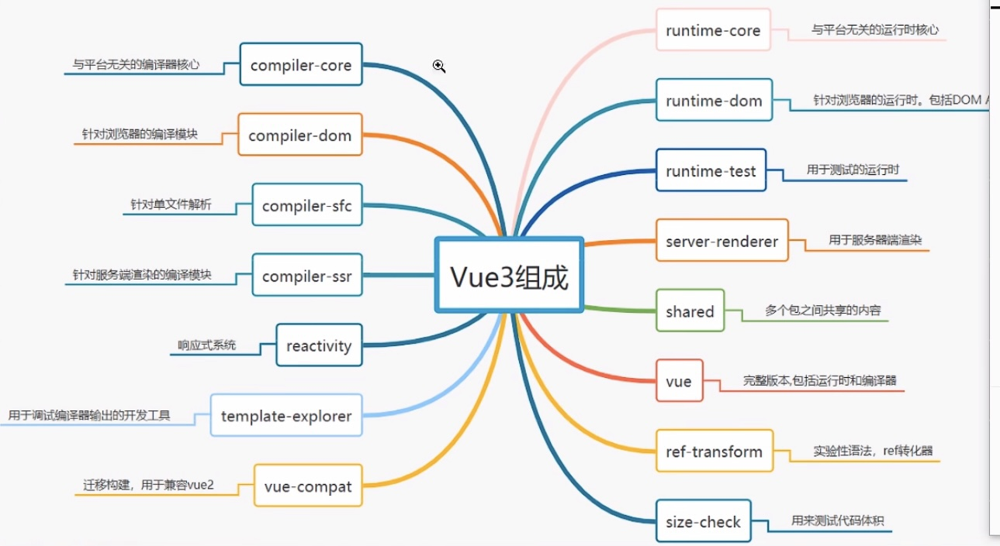

# Vue设计思想
## 拆分模块
Vue3.0更注重模块上的拆分，在2.0中无法单独使用部分模块。需要引入完整的Vuejs(例如只想使用使用响应式部分，但是需要引入完整的uejs),Vue3中的模块之间耦合度低，模块可以独立使用。
## 重写API
Vue2中很多方法挂载到了实例中，导致没有使用也会被打包（还有很多组件也是一样）。通过构建工具Tree-shaking机制实现按需引入，减少用户打包后体积。
## 扩展更方便
Vue3允许自定义渲染器，扩展能力强。不会发生以前的事情，改写Vue源码改造渲染方式。
依然保留Vue2的特色

# 声明式框架
Vue3依旧是声明试的框架，用起来简单。
## 命令式和声明式区别
早在JQ的时代编写的代码都是命令式的，命令式框架重要特点就是关注过程。
声明式框架更加`关注结果`。命令式的代码封装到了Vuejs中，过程靠Vuejs来实现。
注释：声明式代码更加简单，不需要关注实现，按照要求填写代码就可以（给上原料就出结果）
### 命令式编程：
```javascript
let numbers = [1,2,3,4,5]
let total = 0
for (let i = 0; i < numbers.length; i++) {
  total += numbers[i] - 关注了过程
}
console.log(total)
```
### 声明式编程：
```javascript
let numbers = [1,2,3,4,5]
let total2 = numbers.reduce(function (memo,current){
  return memo + current - 不需要关注内部如何实现 直接使用即可
},0)
console.log(total2)
```
## 采用虚拟DOM
传统更新页面，拼接一个完整的字符串innerHTML全部重新渲染，添加虚拟DOM后，可以比较新旧虚拟节点，找到变化在进行更新。虚拟DOM就是一个对象，用来描述真实DOM的。
```javascript
const vnode = {
  __v_isVNode: true,
  __v_skip: true,
  type,
  props,
  key: props & normalizeKey(props),
  ref: props & normalizeRef(props),
  children,
  component: null,
  el: null,
  patchFlag,
  dynamicProps,
  dynamicChildren: null,
  appContext: null
}
```
## 区分编译时和运行时
   * 我们需要有一个虚拟DOM,调用渲染方法将虚拟DOM渲染成真实DOM(缺点就是虚拟DOM编写麻烦)
   * 专门写个编译时可以将模板编译成虚拟DOM(在构建的时候进行编译性能更高，不需要再运行的时候进行编译，而且vue3 在编译中做了很多优化)

# Vue3 整体架构
## 架构介绍
### MOnorepo 管理项目
Monorepo是管理项目代码的一个方式，指在一个项目仓库(repo)中管理多个模块/包(package)。Vue3源码采用monorepo方式进行管理，将模块拆分到backage目录中。
* 一个仓库可维护多个模块，不用到处找仓库
* 方便版本管理和依赖管理，模块之间的引用，调用都非常方便

### Vue3 项目结构


### Vue3采用Typescript
Vue2采用Flow来进行类型检测(Vue2中对TS支持并不友好)，Vue3源码采用Typescript来进行重写，对Ts的支持更加友好。


